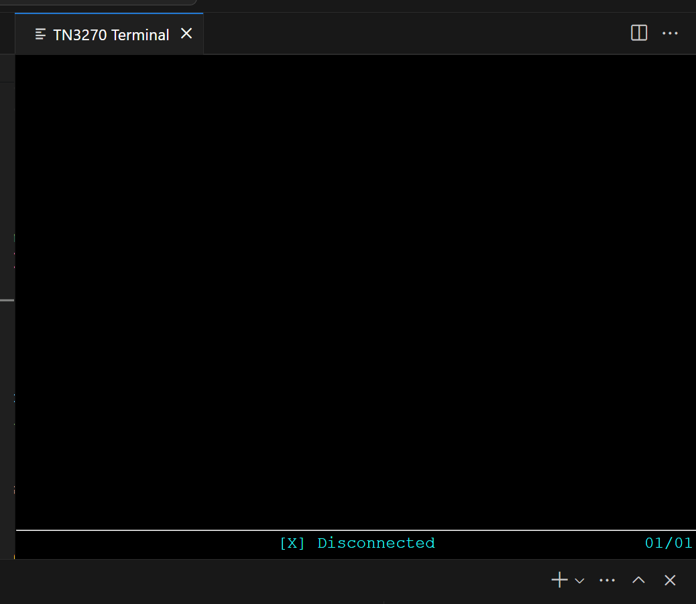

# zterm-js
A native javascript TN3270 api and VS Code extension for scripting and debugging macros. Macros can be written and debugged in VS code with traditional tools and a handy terminal display embedded in VS Code.



# Performance

zterm-js is capable of navigating up to 25 screens per second (or faster), this include recognition, inserting text, and sending commands (AID keys).

# Example

```javascript
var terminal = require('./vscode/terminal'); //this allows the terminal to be seen in VS code as it is navigating. (Requires to installation of the zterm-emulator VSIX file into VS Code - located in the releases (zterm-0.0.1))

async function connect() {
    terminal.setDelayTime(10); //set delay time between interactions (in milliseconds);

    await terminal.connect("<ip or dns or mainframe>", "992"); // 992 is default SSL/TLS port
    console.log("test");

    await terminal.waitForText("Z/OS Main Menu", true, 3000);

    terminal.setText("Test", 2, 4);
    terminal.setText("Hello world!", 16, 12);
    await terminal.sendCommand("[enter]");

    await terminal.waitForText("ISPF Main Menu", true, 3000);
    let extractedText = terminal.getText(6, 4, 10);
    console.log(`'${extractedText}' was successfully extracted`);

    await terminal.disconnect();
}

connect().then(() => {
    console.log("Congratulations!");
}).catch((err) => { console.log(err); });
```

Refer to zterm-api/example.js for more comments and details
